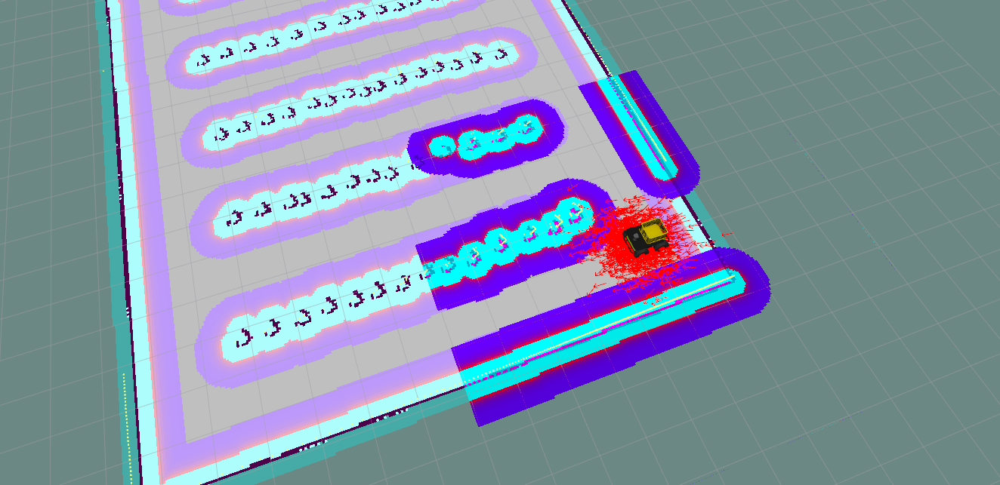
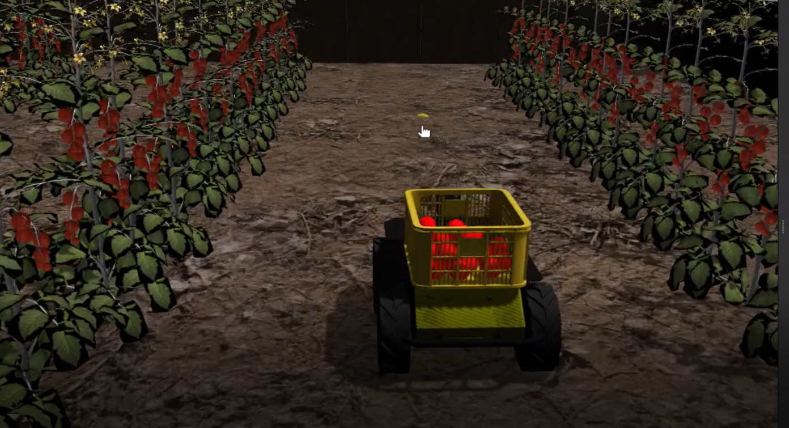
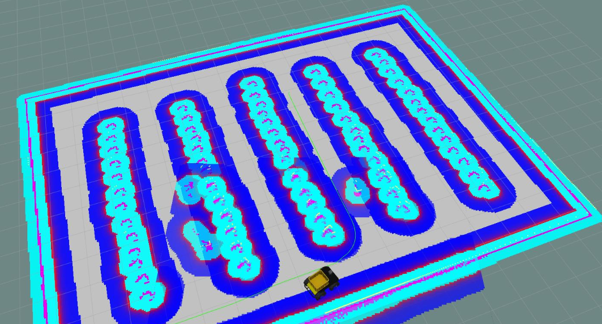

# Agromatic

## _An agro-matic robot simulator_

First, put the content of the folder /models inside in your /.gazebo hidden folder in your /home

AMCL:

Static map:

Map with dynamic obstacles:


How to use
-

To run map+husky, run
-

```sh
roslaunch agromatic_gazebo husky_sim.launch
```

To run _Rviz_, run
-

```sh
roslaunch husky_viz view_robot.launch
```

To run _AMCL_ or _gmappin_ with _"move_base"_ node, run
-

```sh
roslaunch husky_navigation amcl_demo.launch
```

or

```sh
roslaunch husky_navigation gmapping_demo.launch
```

To run the custom python node for sending goals
-

```sh
rosrun sending_goals sg_spawn_tomato.py
```

## Todo

- trying the gmapping and amcl to save a map and locate the robot
- improving the sending_goals.py to implement the tracker for the timer and multiple goals (try with playpen)
(also: draw a custom path in a python program)
- in the sending-goals timer check why it does not read the first two goals and make a node to check that the goal was reached.
- check dwa planner parameters
